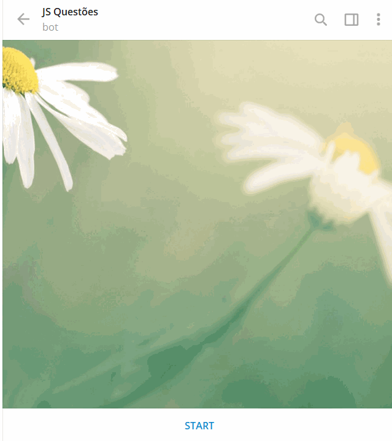

# JS Questões

Bot de perguntas e respostas para auxiliar os alunos de pré-programação da Universidade São Judas Tadeu

---

Para rodar o bot basta executar o comando `npm run start` no diretório da aplicação

---

Criado por: _Miyuki_  
Link para acesso ao bot: t.me/js_questoes_bot  
Link para video no youtube: https://youtu.be/mvWf3BjH7dk

